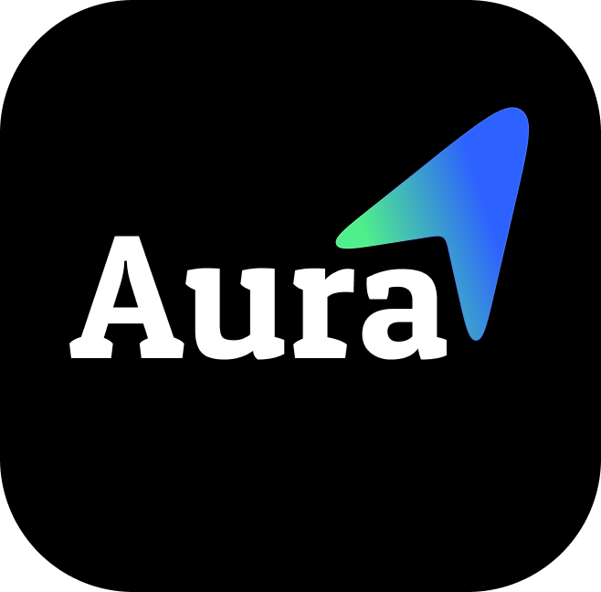
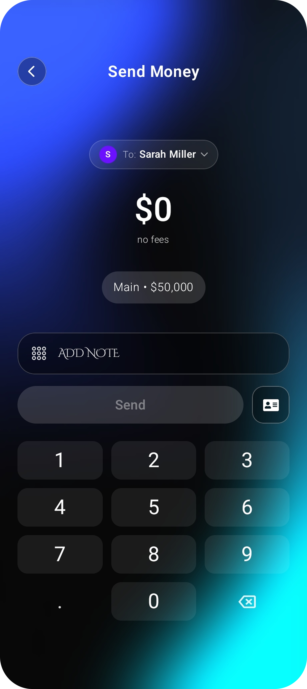

<div align="center">
  

  <h1>NeoBank UI KMP | Enterprise-Grade Fintech Architecture</h1>
  <h3>AuraNova Showcase</h3>

  <p><strong>Redefining the financial experience: high-end design and flawless performance.</strong></p>

[](https://kotlinlang.org)
[](https://www.jetbrains.com/lp/compose-multiplatform/)
[]()
[]()

<p align="center">
  <a href="https://github.com/JastinBolanos/NeoBankUI-KMP/releases/download/v1.2.0/NeoBankUI.apk">
    
  </a>
</p>
</div>

---

## The Vision

An ultra-premium financial interface prototype built with **Kotlin Multiplatform (KMP)** and **Compose Multiplatform**. Designed to deliver a high-end native experience on both Android and iOS from a single codebase.

**AuraNova** goes beyond traditional UI. It establishes a competitive **"visual moat"** through immersive aesthetics and a frictionless user flow (such as the biometric *daily portal*), demonstrating that visual complexity need not come at the expense of performance fluidity.

## Tech Stack & Technical Excellence

The project is structured for scalability, prioritizing separation of concerns, testability, and efficient cross-platform rendering.

* **Core & UI Framework:** Kotlin Multiplatform + Compose Multiplatform, sharing 100% of the visual logic.
* **Architecture:** Clean Architecture (*Feature-driven*) with rigorous state management (*State Hoisting*).
* **UI/UX Design:** *Dark Mode* interface featuring complex *Glassmorphism* elements, layered components, and custom typography.
* **Performance:** Extreme asset optimization (smart rasterization) to ensure 60fps+ transitions, with explicit support for **120Hz ProMotion on iOS** (`CADisableMinimumFrameDurationOnPhone`).
* **Infinite Carousel:** Advanced technical implementation using `HorizontalPager`, managing continuous, seamless scrolling state.
* **Automated CI/CD:** GitHub Actions workflow for continuous validation and remote compilation of the iOS scheme via `xcodebuild` on macOS virtual machines.
* **Native Multiplatform Navigation:** Custom intelligent back-stack management utilizing the `expect/actual` pattern to flawlessly intercept Android hardware back presses (`KmpBackHandler`) without breaking iOS gesture flows.
* **Granular Security UX:** Dynamic, state-driven privacy masking for sensitive financial data (Total Balance, CCV, Card Numbers) featuring auto-hide triggers upon user scrolling.
* **Smart Interactions:** Native-feeling gesture detection (`detectHorizontalDragGestures`) for swipe-to-dismiss side menus, coupled with staggered entrance animations (Fade-in + Slide-up) to eliminate UI jarring.

---
###  Live Demo: NeoBank KMP in Action
> ** Observe every detail:** appreciate the fluidity of the native animations, the *glassmorphism* effects, the infinite carousel, and the visual consistency across screens. This video showcases the complete experience of NeoBank KMP, a high-end financial prototype developed entirely using Kotlin Multiplatform and Compose Multiplatform.

https://github.com/user-attachments/assets/f5365b66-90d8-4dde-bfa4-d68650a14556

---

## Case Study: UI/UX Design & Multiplatform Engineering

AuraNova is not just a visual showcase; it is a masterclass in frontend engineering using **Kotlin Multiplatform (KMP) and Compose**. What makes this frontend truly valuable is its obsession with native fluidity, deep UX psychology, and architectural robustness.

Every single pixel has been meticulously crafted to build user trust and elevate the financial experience. From the **"breathing" pulse animations** on the home screen to the **staggered slide-up transitions**, the app delivers a world-class, premium feel. We've pushed the boundaries of *Glassmorphism* (real-time blurring and translucent layering) while maintaining strict accessibility standards and granular data privacy.

> **Technical Note:** All views rendered below are 100% native code (Compose Multiplatform), without the use of WebViews or hybrid frameworks. The fluidity of the native animations and the seamless multiplatform back-navigation are best experienced when compiling the project on a physical device.

---

### 1. Biometric Access & Contextual Navigation
The user journey begins with a stunning, friction-free authentication screen. By utilizing Z-index depth blurring and sleek typography, the app immediately establishes a high-end, secure environment. Once inside, global navigation is handled by an interactive side menu featuring a warm, premium gradient that can be dismissed with fluid, native swipe gestures, revealing the beautifully blurred dashboard behind it.

<p align="center">
  
  &nbsp;&nbsp;&nbsp;&nbsp;&nbsp;&nbsp;
  
</p>

---

### 2. Main Dashboard & Infinite Promotional Carousel
The core of the application is designed for maximum engagement. It features an advanced `HorizontalPager`, enabling cyclical auto-scrolling navigation between highly visual financial offers. Each banner utilizes complex layer rendering (soft shadows, light glows, and translucent overlays) to achieve realistic metallic and titanium textures set against an immersive, adaptive gradient background.

<p align="center">
  
  &nbsp;&nbsp;
  
  &nbsp;&nbsp;
  
</p>

---

### 3. Granular Privacy, History & Smart Transfers
Financial data readability and security are paramount. The UI features dynamic "eye" toggles to mask sensitive card data elegantly. The transaction history is presented on floating, semi-transparent sheets that seamlessly blend with the background. Transfers boast a sleek, perfectly balanced layout featuring a custom Compose Numpad and a "Smart Send Button" that elegantly illuminates only when valid input is detected.

<p align="center">
  
  &nbsp;&nbsp;
  
  &nbsp;&nbsp;
  
</p>

---

### 4. Premium Offers & High-End Personalization
The experience is rounded out by highly personalized spaces that make the user feel like a VIP client. The premium banners continue the immersive aesthetic with deep dark themes and glowing accents. Furthermore, the profile settings feature perfect circular cropping and sleek layout management, ensuring the interface never feels cluttered while maintaining the sophisticated aura of a next-generation NeoBank.

<p align="center">
  
  &nbsp;&nbsp;
  
  &nbsp;&nbsp;
  
</p>

---

## How to run the project

### Prerequisites
* **Android:** Android Studio Ladybug (or higher) with the Kotlin Multiplatform plugin.
* **iOS:** Mac with Xcode 16+ installed.

### Instructions
1. Clone this repository:
   ```bash
   git clone [https://github.com/JastinBolanos/NeoBankUI-KMP.git](https://github.com/JastinBolanos/NeoBankUI-KMP.git)
   cd NeoBankUI-KMP

2. **For Android:** Open the project in Android Studio, select the `composeApp` configuration, and press *Run*.
3. **For iOS:**
   * Open the `iosApp` folder in Xcode.
   * Wait for *Swift* and *Assets* indexing to complete.
   * Select a simulator (e.g., iPhone 16/17) and press `Cmd + R`. Xcode will automatically delegate the compilation of the Kotlin framework to Gradle.

---

## License and Intellectual Property

This repository is protected under a **Proprietary Restricted-Use License**.

* The source code is provided strictly for purposes of **study, learning, and technical evaluation**.
* Plagiarism of the visual structure (box arrangement, programmatic gradients, color palettes, and layouts)—as well as unauthorized commercial use or partial republication on third-party platforms—is **strictly prohibited**.
* Please read the [LICENSE](./LICENSE) file for the full legal terms and commercial conditions.
* For information regarding the attribution of third-party graphic assets (3D renders legitimately obtained from the Figma community), please consult the [ASSETS_LICENSE](./ASSETS_LICENSE.md) statement.
