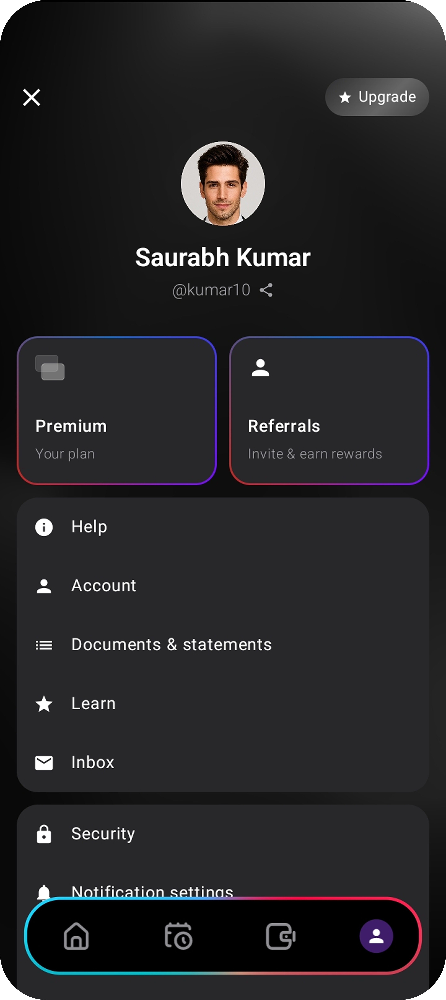

<div align="center">
  

  <h1>NeoBank UI</h1>
  <h3>AuraNova</h3>

  <p><strong>Redefining the financial experience: high-end design and flawless performance.</strong></p>

[](https://kotlinlang.org)
[](https://www.jetbrains.com/lp/compose-multiplatform/)
[]()
[]()
</div>

---

## The Vision

An ultra-premium financial interface prototype built with **Kotlin Multiplatform (KMP)** and **Compose Multiplatform**. Designed to deliver a high-end native experience on both Android and iOS from a single codebase.

**AuraNova** goes beyond traditional UI. It establishes a competitive **"visual moat"** through immersive aesthetics and a frictionless user flow (such as the biometric *daily portal*), demonstrating that visual complexity need not come at the expense of performance fluidity.

## Tech Stack & Technical Excellence

The project is structured for scalability, prioritizing separation of concerns, testability, and efficient cross-platform rendering.

* **Core & UI Framework:** Kotlin Multiplatform + Compose Multiplatform, sharing 100% of the visual logic.
* **Architecture:** Clean Architecture (*Feature-driven*) with rigorous state management (*State Hoisting*).
* **UI/UX Design:** *Dark Mode* interface featuring complex *Glassmorphism* elements, layered components, and custom typography.
* **Performance:** Extreme asset optimization (smart rasterization) to ensure 60fps+ transitions, with explicit support for **120Hz ProMotion on iOS** (`CADisableMinimumFrameDurationOnPhone`).
* **Infinite Carousel:** Advanced technical implementation using `HorizontalPager`, managing continuous, seamless scrolling state.
* **Automated CI/CD:** GitHub Actions workflow for continuous validation and remote compilation of the iOS scheme via `xcodebuild` on macOS virtual machines.

---

## Case Study: UI/UX Design

AuraNova design architecture focuses on reducing cognitive load through clear visual hierarchies, supported by extensive use of *Glassmorphism* (real-time blurring) and an immersive gradient palette.

> **Technical Note:** All views rendered below are 100% native code (Compose Multiplatform), without the use of WebViews or hybrid frameworks. The fluidity of the native animations is best experienced when compiling the project on a physical device.

### 1. Biometric Access Portal
The user journey begins with a friction-free authentication screen. A dynamic blur is applied to the underlying cards, creating a depth-of-field effect (Z-index) that draws focus toward the biometric sensor.

<p align="center">
  
</p>

---

### 2. Main Dashboard & Infinite Promotional Carousel
The core of the application. An advanced `HorizontalPager` was implemented, enabling cyclical navigation between various financial offers. Each banner utilizes layer rendering (shadows and blurs) to achieve metallic and glass-like textures set against an adaptive gradient background.

<p align="center">
  
  
  
  
  
</p>

---

### 3. Card Management and Transaction History
Screens focused on the readability of financial data. Containers with rounded corners and reduced opacity (*Surface Glassmorphism*) are used to maintain the immersion of the background gradient without sacrificing text contrast (accessibility).

<p align="center">
  
  &nbsp;&nbsp;&nbsp;&nbsp;&nbsp;&nbsp;
  
</p>

---

### 4. Transfers and Profile Navigation
* **Send Money:** Implementation of a custom numeric keypad (Custom Numpad) in Compose, ensuring the design aligns with the overall Design System and bypassing the limitations of operating system keyboards.
* **Profile Menu:** Use of side navigation (Drawer/Modal) with a progressive blur effect over the main screen, maintaining the application context.

<p align="center">
  
  &nbsp;&nbsp;&nbsp;
  
  &nbsp;&nbsp;&nbsp;
  
</p>

---

## How to run the project

### Prerequisites
* **Android:** Android Studio Ladybug (or higher) with the Kotlin Multiplatform plugin.
* **iOS:** Mac with Xcode 16+ installed.

### Instructions
1. Clone this repository:
   ```bash
   git clone [https://github.com/JastinBolanos/NeoBankUI-KMP.git](https://github.com/JastinBolanos/NeoBankUI-KMP.git)
   cd NeoBankUI-KMP

2. **For Android:** Open the project in Android Studio, select the `composeApp` configuration, and press *Run*.
3. **For iOS:**
   * Open the `iosApp` folder in Xcode.
   * Wait for *Swift* and *Assets* indexing to complete.
   * Select a simulator (e.g., iPhone 16/17) and press `Cmd + R`. Xcode will automatically delegate the compilation of the Kotlin framework to Gradle.

---

## ⚖️ License and Intellectual Property

This repository is protected under a **Proprietary Restricted-Use License**.

* The source code is provided strictly for purposes of **study, learning, and technical evaluation**.
* Plagiarism of the visual structure (box arrangement, programmatic gradients, color palettes, and layouts)—as well as unauthorized commercial use or partial republication on third-party platforms—is **strictly prohibited**.
* Please read the [LICENSE](./LICENSE) file for the full legal terms and commercial conditions.
* For information regarding the attribution of third-party graphic assets (3D renders legitimately obtained from the Figma community), please consult the [ASSETS_LICENSE](./ASSETS_LICENSE.md) statement.
