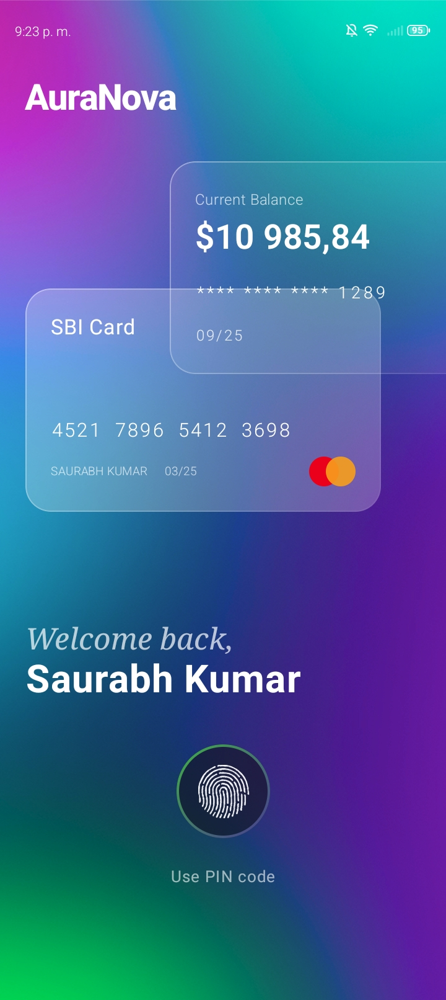
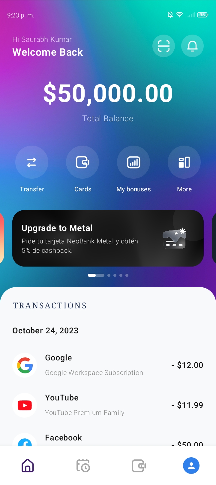
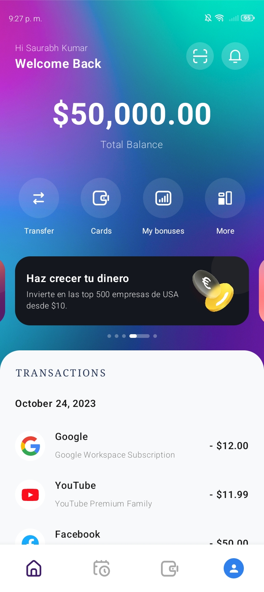
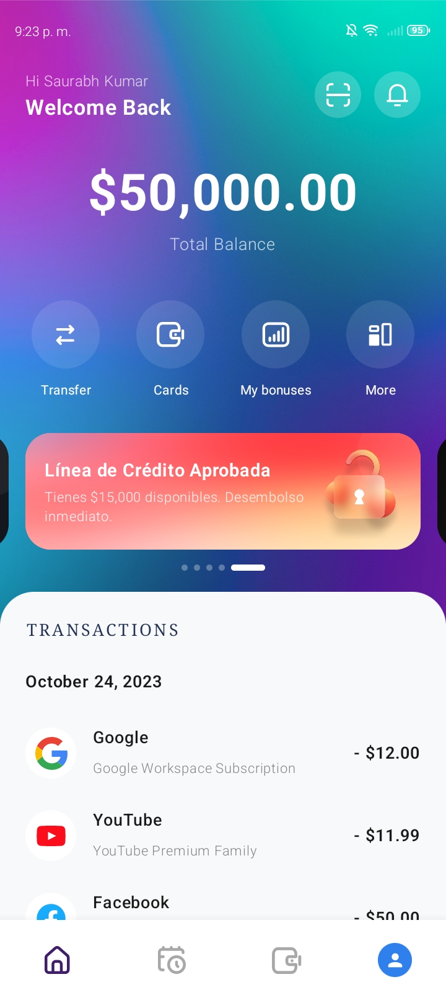
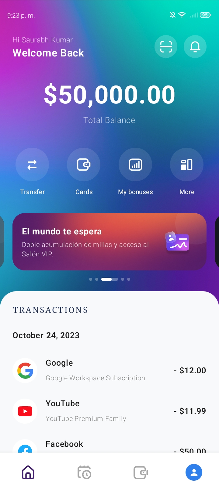
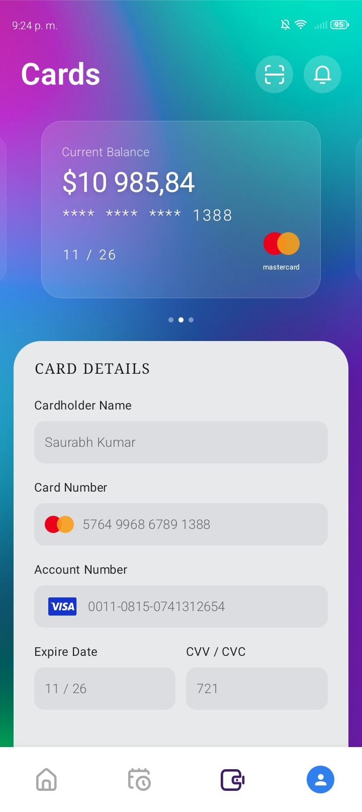
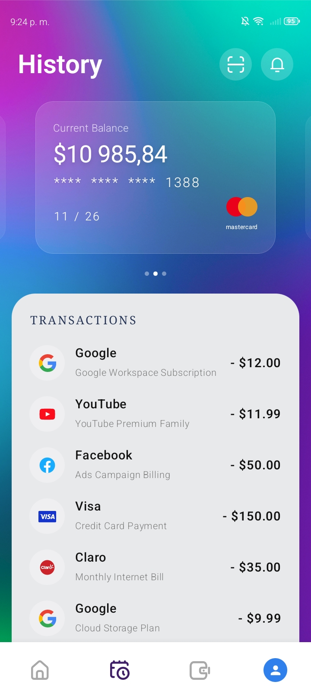
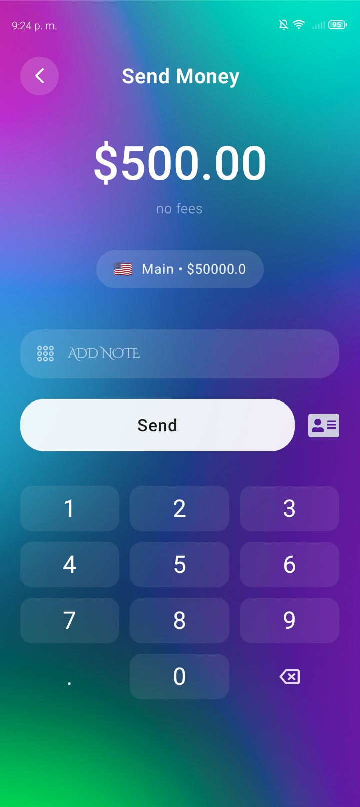
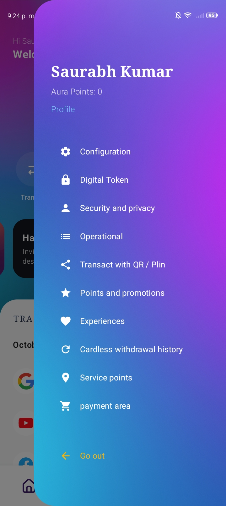
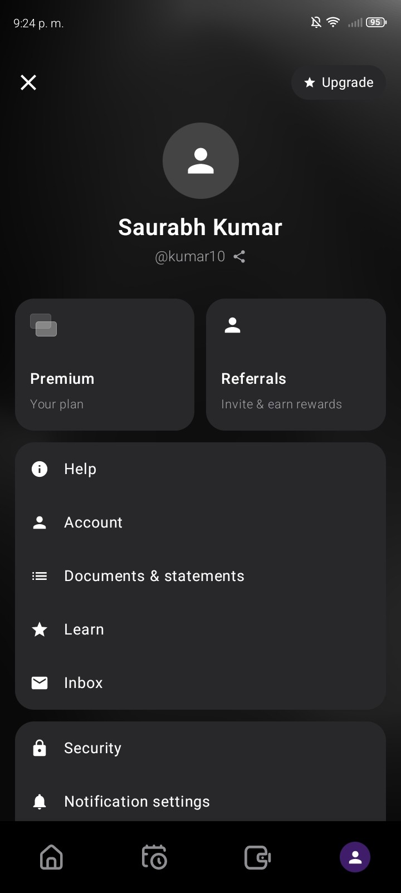

<div align="center">
  

  <h1>NeoBank UI</h1>
  <h3>AuraNova</h3>

  <p><strong>Redefiniendo la experiencia financiera: diseño de alta gama y rendimiento impecable.</strong></p>

[](https://kotlinlang.org)
[](https://www.jetbrains.com/lp/compose-multiplatform/)
[]()
[]()
</div>

---

## La Visión

Un prototipo de interfaz financiera ultra-premium construido con **Kotlin Multiplatform (KMP)** y **Compose Multiplatform**. Diseñado para ofrecer una experiencia nativa de alta gama tanto en Android como en iOS desde un único código base.

**AuraNova** va más allá de la UI tradicional. Establece un **"foso visual"** competitivo mediante una estética inmersiva y un flujo de usuario sin fricción (como el *portal diario* biométrico), demostrando que la complejidad visual no tiene por qué sacrificar la fluidez del rendimiento.

## Stack y Excelencia Técnica

El proyecto está estructurado para escalar, priorizando la separación de responsabilidades, la testabilidad y la eficiencia en el renderizado multiplataforma.

* **Core & UI Framework:** Kotlin Multiplatform + Compose Multiplatform para compartir el 100% de la lógica visual.
* **Arquitectura:** Clean Architecture (*Feature-driven*) con un riguroso manejo de estado (*State Hoisting*).
* **Diseño UI/UX:** Interfaz *Dark Mode* con elementos complejos de *Glassmorphism*, capas superpuestas y tipografía personalizada.
* **Performance:** Optimización extrema de *assets* (rasterización inteligente) para garantizar transiciones a 60fps+, con soporte explícito para **ProMotion a 120Hz en iOS** (`CADisableMinimumFrameDurationOnPhone`).
* **Carrusel Infinito:** Implementación técnica avanzada utilizando `HorizontalPager`, gestionando el estado de desplazamiento continuo sin saltos.
* **CI/CD Automatizado:** Flujo de trabajo integrado en GitHub Actions para la validación continua y compilación remota del esquema de iOS mediante `xcodebuild` en máquinas virtuales macOS.

---

## Case Study: Diseño de Interfaz (UI/UX)

La arquitectura de diseño de AuraNova se centra en la reducción de la carga cognitiva mediante jerarquías visuales claras, apoyadas por un uso extensivo de *Glassmorphism* (desenfoques en tiempo real) y una paleta de gradientes inmersiva.

> **Nota Técnica:** Todas las vistas renderizadas a continuación son 100% código nativo (Compose Multiplatform), sin uso de WebViews ni frameworks híbridos. La fluidez de las animaciones nativas se aprecia en su máxima expresión al compilar el proyecto en un dispositivo físico.

### 1. Portal de Acceso Biométrico
El flujo de usuario comienza con una pantalla de autenticación diseñada sin fricciones. Se emplea un desenfoque dinámico sobre las tarjetas subyacentes, creando un efecto de profundidad de campo (Z-Index) que guía el foco hacia el sensor biométrico.

<p align="center">
  
</p>

---

### 2. Dashboard Principal & Carrusel Promocional Infinito
El núcleo de la aplicación. Se implementó un `HorizontalPager` avanzado que permite una navegación cíclica entre diferentes ofertas financieras. Cada banner utiliza renderizado de capas (sombras y desenfoques) para lograr texturas metálicas y de cristal sobre un fondo de gradiente adaptativo.

<p align="center">
  
  
  
  
</p>

---

### 3. Gestión de Tarjetas e Historial de Transacciones
Pantallas enfocadas en la legibilidad de datos financieros. Se utilizan contenedores con bordes redondeados y opacidad reducida (*Surface Glassmorphism*) para mantener la inmersión del gradiente de fondo sin sacrificar el contraste del texto (accesibilidad).

<p align="center">
  
  &nbsp;&nbsp;&nbsp;&nbsp;&nbsp;&nbsp;
  
</p>

---

### 4. Transferencias y Navegación Perfil
* **Send Money:** Implementación de un teclado numérico personalizado (Custom Numpad) en Compose, asegurando que el diseño coincida con el *Design System* general, escapando de las limitaciones de los teclados del sistema operativo.
* **Menú Perfil:** Uso de navegación lateral (*Drawer/Modal*) con un desenfoque progresivo sobre la pantalla principal, manteniendo el contexto de la aplicación.

<p align="center">
  
  &nbsp;&nbsp;&nbsp;
  
  &nbsp;&nbsp;&nbsp;
  
</p>

---

## Cómo ejecutar el proyecto

### Prerrequisitos
* **Android:** Android Studio Ladybug (o superior) con el plugin de Kotlin Multiplatform.
* **iOS:** Mac con Xcode 16+ instalado.

### Instrucciones
1. Clona este repositorio:
   ```bash
   git clone (https://github.com/JastinBolanos/NeoBankUI-KMP.git)

2. **Para Android:** Abre el proyecto en Android Studio, selecciona la configuración `composeApp` y presiona *Run*.
3. **Para iOS:**
   * Abre la carpeta `iosApp` en Xcode.
   * Espera a que la indexación de *Swift* y *Assets* termine.
   * Selecciona un simulador (ej. iPhone 16/17) y presiona `Cmd + R`. Xcode delegará automáticamente la compilación del framework de Kotlin a Gradle.

---

## Licencia y Propiedad Intelectual

Este repositorio está protegido bajo una **Licencia Propietaria de Uso Restringido**.

* El código fuente se expone estrictamente con fines de **estudio, aprendizaje y evaluación técnica**.
* **Queda estrictamente prohibido** el plagio de la estructura visual (disposición de cajas, gradientes por código, paletas de colores y layouts), así como su uso comercial no autorizado o republicación parcial en plataformas de terceros.
* Para consultar los términos legales completos y las condiciones comerciales, lea el archivo [LICENSE](./LICENSE).
* Para información sobre la atribución de recursos gráficos de terceros (renders 3D obtenidos legítimamente de la comunidad de Figma), consulte la declaración [ASSETS_LICENSE](./ASSETS_LICENSE.md).